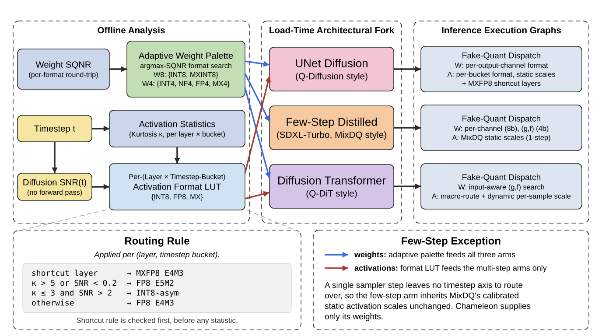

<p align="center">
  
</p>

<h1 align="center">Chameleon</h1>
<p align="center"><b>Dynamic Format Adapter for Efficient Diffusion</b></p>

<p align="center">
  <a href="https://arxiv.org/abs/2609.33496"></a>
  <a href="https://arnabsanyal.github.io/iclr2027/chameleon.html"></a>
  <a href="LICENSE"></a>
  
  
  
</p>

<p align="center">
  <a href="https://arnabsanyal.github.io/">Arnab Sanyal</a> &nbsp;·&nbsp; Sandeep Chinchali<br>
  The University of Texas at Austin
</p>

> **TL;DR** Every diffusion PTQ method we compare against fixes the number format (almost always INT8) and only
> tunes scales around it. Chameleon keeps the bit-width fixed and makes the format itself a choice, made per weight
> channel and per (layer, timestep bucket) activation tensor from two cheap statistics. It gets the best FID in all
> six backbone × bit-width settings we test.

<p align="center">
  
  
  &nbsp;
  
  
  &nbsp;
  
  
  <br>
  <sub>W4A8, COCO-2014 caption <i>"An old city fire hydrant has 'Love was found here' painted on it."</i>
  Pairs, left to right: Q-Diffusion vs. Chameleon (SDXL), MixDQ vs. Chameleon (SDXL-Turbo), Q-DiT vs. Chameleon (PixArt-α).</sub>
</p>

## Abstract

Post-training quantization (PTQ) is the standard way to run modern diffusion models on memory-constrained
accelerators, yet every existing diffusion PTQ scheme fixes the number format in advance and only tunes the scale,
zero point, or per-layer bit-width. At a fixed bit-width the best format depends on the distribution being encoded,
and that distribution differs across weight channels, across layers, and along the diffusion timestep, where
activation distributions slide from heavy-tailed and noise-dominated to tightly clustered and structured. We propose
Chameleon, a PTQ framework that holds the bit-width fixed and treats the format itself as a discrete variable, chosen
per weight channel and per (layer, timestep bucket) activation tensor. Activation formats come from {INT8, FP8 E4M3,
FP8 E5M2, MXFP8, MXINT8}, selected ahead of time from two cheap statistics (empirical kurtosis and the closed-form
diffusion SNR) and stored in a lookup table; weight formats come from {INT8, MXINT8} at 8 bits or {INT4, NF4, FP4
E2M1, MXINT4, MXFP4} at 4 bits, selected offline by reconstruction error. An architectural fork adapts the same
selection layer to multi-step UNets, single-step distilled models, and Diffusion Transformers. Across SDXL,
SDXL-Turbo, and PixArt-α on COCO-2014, Chameleon achieves the best FID in all six backbone × bit-width settings, with
CLIP within 0.24 of the FP16 reference and the best of all quantized methods at W4A8.

## How it works

<p align="center"></p>

- **Weights** are static, so their format is chosen offline: per output channel (SDXL) or per layer jointly with
  the group size (SDXL-Turbo at 4 bits, PixArt-α), by maximizing reconstruction SQNR.
- **Activations** depend on the input, so their format is chosen from calibration statistics and stored in a
  per-(layer, timestep bucket) lookup table that the runtime reads once per layer per step:

  | Condition (checked in order)                    | Activation format |
  |-------------------------------------------------|-------------------|
  | UNet shortcut-concatenation layer               | MXFP8 E4M3        |
  | kurtosis κ > 5 or diffusion SNR < 0.2           | FP8 E5M2          |
  | κ ≤ 3 and SNR > 2                               | INT8 (asymmetric) |
  | otherwise                                       | FP8 E4M3          |

- **An architectural fork** threads the same selection layer through each model family's established PTQ recipe
  instead of replacing it: Q-Diffusion-style static scales for UNets, MixDQ's calibrated activations for the
  one-step SDXL-Turbo (Chameleon supplies only the weights there), and Q-DiT-style dynamic per-sample scaling for
  DiTs. Per-path diagrams: [UNet](assets/figures/unet_path.png), [DiT](assets/figures/dit_path.png).

## Results

COCO-2014, 24,576 prompts (one image per caption). Clean-FID against the full val2014 set; CLIP-score with
ViT-L/14 (cosine × 100). All quantized numbers use fake quantization on a single A100.

| Backbone | Method | Bits | FID ↓ | CLIP ↑ |
|---|---|---|---:|---:|
| **SDXL** (50 steps, CFG 7.5, 1024²) | FP16 | W16A16 | 16.16 | 26.88 |
| | Q-Diffusion | W8A8 | 14.70 | 26.77 |
| | PTQ4DM | W8A8 | 14.65 | 26.68 |
| | **Chameleon** | W8A8 | **14.23** | 26.70 |
| | Q-Diffusion | W4A8 | 21.41 | 26.27 |
| | PTQ4DM | W4A8 | 21.82 | 26.21 |
| | **Chameleon** | W4A8 | **14.43** | **26.64** |
| **SDXL-Turbo** (1 step, no CFG, 512²) | FP16 | W16A16 | 21.63 | 26.63 |
| | MixDQ | W8A8 | 21.43 | 26.64 |
| | **Chameleon** | W8A8 | **20.93** | 26.62 |
| | MixDQ | W4A8 | 24.50 | 25.88 |
| | **Chameleon** | W4A8 | **21.29** | **26.85** |
| **PixArt-α** (20 steps, CFG 4.5, 1024²) | FP16 | W16A16 | 27.63 | 25.99 |
| | Q-DiT | W8A8 | 27.69 | 25.99 |
| | **Chameleon** | W8A8 | **24.33** | 25.81 |
| | Q-DiT | W4A8 | 23.53 | 25.73 |
| | **Chameleon** | W4A8 | **22.24** | **26.09** |

Ablations (routing signals, palette, bucket count, per-fork additions) are in Appendix A.9 of the paper and in
[`src/ablations`](src/ablations).

## About ICLR 2027

This work is under review at the [International Conference on Learning Representations (ICLR) 2027](https://iclr.cc/).

## Cite this work

```bibtex
@misc{sanyal2026chameleon,
  title         = {Chameleon: Dynamic Format Adapter for Efficient Diffusion},
  author        = {Sanyal, Arnab and Chinchali, Sandeep},
  year          = {2026},
  eprint        = {2609.33496},
  archivePrefix = {arXiv},
  primaryClass  = {cs.LG},
  url           = {https://arxiv.org/abs/2609.33496},
  howpublished  = {Under review at the International Conference on Learning Representations (ICLR) 2027}
}
```

## Contact

Arnab Sanyal — [sanyal@utexas.edu](mailto:sanyal@utexas.edu) · [arnabsanyal.github.io](https://arnabsanyal.github.io/).
Bug reports and questions are welcome as GitHub issues.

## Installing Dependencies

Tested on Linux with an NVIDIA A100 80 GB, CUDA 13.0, Python 3.12 and PyTorch 2.11.

```bash
git clone https://github.com/arnabsanyal/Chameleon.git
cd Chameleon/install
bash install.sh      # creates the `chameleon` conda env, installs requirements and builds MixDQ's kernels
bash verify.sh       # checks the environment
cd ..
conda activate chameleon
```

`install/environment.yml` is the exact conda environment the paper's numbers were produced with
(`conda env create -f install/environment.yml`), if you prefer to pin everything.

**MixDQ setup (needed for both SDXL-Turbo rows).** MixDQ ships its quantized SDXL-Turbo as a Hugging Face custom
pipeline that supports W8A8 only. Run these once after installing (and the first again if you clear the Hugging Face
cache):

```bash
bash third_party/mixdq/apply_patch.sh      # patch MixDQ's pipeline: W4A8 fake-quant path + Chameleon weight fold
bash third_party/mixdq/fetch_configs.sh    # download MixDQ's mixed-precision configs from its repository
```

See [`third_party/mixdq`](third_party/mixdq) for what each step changes and the pinned upstream revisions.

### Paths and data

All scripts read two environment variables and otherwise default to folders inside the repository:

| Variable | Default | Contents |
|---|---|---|
| `CHAMELEON_DATA_ROOT` | `./data` | datasets; COCO-2014 is expected at `coco/val2014/` and `coco/annotations/captions_val2014.json` |
| `CHAMELEON_OUTPUT_ROOT` | `./outputs` | generated images, scores and calibration artifacts |

```bash
mkdir -p data/coco && cd data/coco
wget http://images.cocodataset.org/zips/val2014.zip && unzip -q val2014.zip
wget http://images.cocodataset.org/annotations/annotations_trainval2014.zip && unzip -q annotations_trainval2014.zip
cd ../..
```

## Reproducing the paper

Each backbone has a Python entry point and an interactive `run_*.sh` menu next to it; the menus' "COCO evaluation"
options are the configurations behind Table 1. The commands below are their non-interactive equivalents, run from
the repository root. Use `--num-samples 24576` for the full table, or fewer for a quick check.

```bash
CAPS=data/coco/annotations/captions_val2014.json

# SDXL (UNet path): calibrates the activation LUT, selects per-channel weight formats, then generates
python src/sdxl-chameleon/generation/chameleon_generation.py --weight-bits 4 \
    --coco-captions $CAPS --num-samples 24576 --num-calibration-samples 128 \
    --num-inference-steps 50 --guidance-scale 7.5 \
    --save-weights outputs/chameleon/sdxl_w4a8_weights.json --output-dir outputs/chameleon/coco_eval

# SDXL-Turbo (few-step path): Chameleon weights on top of MixDQ's calibrated activations
python src/chameleon-lcm/generation/chameleon_lcm_generation.py --chameleon-weights --w-bit 4 --a-bit 8 \
    --num-inference-steps 1 --guidance-scale 0.0 --height 512 --width 512 \
    --coco-captions $CAPS --num-samples 24576

# PixArt-alpha (DiT path): W4A8 uses input-aware (g, f) weight selection
python src/chameleon-dit/generation/chameleon_dit_generation.py --weight-bits 4 --input-aware-weights \
    --num-calibration-samples 128 --num-inference-steps 20 --guidance-scale 4.5 \
    --coco-captions $CAPS --num-samples 24576 --save-weights outputs/chameleon-dit/w4a8.json

# Score a folder of generated images: clean-FID vs. val2014 and CLIP vs. the matching captions
python src/paper_figures/score_24k.py <image_dir> --label <name>
```

`--save-weights` / `--load-weights` (and `--save-activation-lut` / `--load-activation-lut` on SDXL) store and reuse
the calibration artifacts, so a configuration only has to be calibrated once.

Baselines live beside the Chameleon paths (see the table below). For example, the MixDQ W4A8 baseline uses MixDQ's
released mixed-precision configs:

```bash
python src/mixdq-lcm/generation/mixdq_lcm_generation.py --w-bit 8 \
    --w-config src/mixdq-lcm/generation/configs/weight_4.00.yaml \
    --a-config src/mixdq-lcm/generation/configs/act_8.00.yaml \
    --coco-captions $CAPS --num-samples 24576
```

### Repository layout

| Folder | Role |
|---|---|
| `src/sdxl-chameleon` | **Chameleon**, UNet path (SDXL): activation LUT, per-channel weight formats, MXFP8 shortcut pin |
| `src/chameleon-lcm` | **Chameleon**, few-step path (SDXL-Turbo): adaptive weight fold over MixDQ |
| `src/chameleon-dit` | **Chameleon**, DiT path (PixArt-α): joint (group size, format) weights, dynamic per-sample activation scaling |
| `src/baseline` | FP16 reference, SDXL |
| `src/lcm` | FP16 reference, SDXL-Turbo |
| `src/pixart-alpha` | FP16 reference, PixArt-α |
| `src/q-baselines` | Q-Diffusion and PTQ4DM baselines, SDXL |
| `src/mixdq-lcm` | MixDQ baseline, SDXL-Turbo |
| `src/q-dit` | Q-DiT baseline, PixArt-α |
| `src/ablations` | ablation arms (Appendix A.9) with a parallel GPU dispatcher; see its README |
| `src/paper_figures` | scoring (`score_24k.py`) and figure-building scripts |
| `src/test` | metrics: clean-FID, CLIP-score, timing instrumentation |
| `install` | environment installer, verifier and pinned conda environment |
| `third_party/mixdq` | patch for MixDQ's Hugging Face pipeline |

## Model artifacts and samples

Chameleon does not ship quantized weights: it quantizes the public checkpoints
([SDXL base 1.0](https://huggingface.co/stabilityai/stable-diffusion-xl-base-1.0),
[SDXL-Turbo](https://huggingface.co/stabilityai/sdxl-turbo),
[PixArt-α XL/2 1024-MS](https://huggingface.co/PixArt-alpha/PixArt-XL-2-1024-MS)) at load time. What is worth
downloading is the calibration output (activation LUTs and weight-format configs, from about 100 KB to 18 MB per
model) and the generated samples. Links will be added here when they are released.

## Extending Chameleon

The format palette, the routing rule and the architectural fork are kept separate so that each can change on its
own: palettes and quantizers live in `*_quant.py`, the routing thresholds in `snr_format_selector.py`, and the
model-specific wiring in each path's `*_generation.py`. A new backbone typically needs only a new path folder that
reuses the palette and the routing rule.

## TODO

- [ ] Release calibration artifacts (activation LUTs, weight-format configs) for all six Table 1 settings
- [ ] Release the generated COCO-2014 samples behind Table 1
- [ ] Measure latency and memory with native FP8 / MX kernels

## References

- **Q-Diffusion**: Li et al., ICCV 2023 — [github.com/Xiuyu-Li/q-diffusion](https://github.com/Xiuyu-Li/q-diffusion)
- **PTQ4DM**: Shang et al., CVPR 2023 — [github.com/42Shawn/PTQ4DM](https://github.com/42Shawn/PTQ4DM)
- **MixDQ**: Zhao et al., ECCV 2024 — [github.com/A-suozhang/MixDQ](https://github.com/A-suozhang/MixDQ), [huggingface.co/nics-efc/MixDQ](https://huggingface.co/nics-efc/MixDQ)
- **Q-DiT**: Chen et al., CVPR 2025
- **OCP Microscaling (MX) formats**: [OCP MX specification v1.0](https://www.opencompute.org/documents/ocp-microscaling-formats-mx-v1-0-spec-final-pdf)
- **clean-fid**: Parmar et al., CVPR 2022 — [github.com/GaParmar/clean-fid](https://github.com/GaParmar/clean-fid)

## License

[MIT](LICENSE). `third_party/mixdq/mixdq_pipeline.patch` modifies MixDQ's Hugging Face pipeline (MIT); MixDQ's configs
are downloaded from its repository rather than redistributed. See [`third_party/mixdq`](third_party/mixdq).
